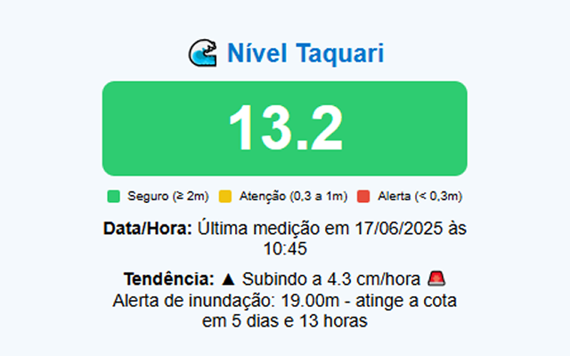

# Monitor Nível do Rio Taquari – Lajeado 🌊

Extensão para Google Chrome que monitora o nível do Rio Taquari em Lajeado/RS e emite notificações quando a cota de alerta se aproxima.

## 📦 Funcionalidades
- Atualização automática a cada 30 minutos
- Atualização manual ao abrir a extensão
- Notificação quando o nível atinge a cota de alerta
- Exibição visual clara com legenda por cores (verde, amarelo, vermelho)

## 🖼️ Exemplo de uso

## 🔗 Fonte dos dados
Os dados são obtidos publicamente via: [https://nivelguaiba.com.br/lajeado](https://nivelguaiba.com.br/lajeado)

## 🔒 Privacidade
Nenhum dado pessoal é coletado ou compartilhado.

---
